Configurar la coordenada Y del Objetivo en 0
1. Poner al Objetivo una coordenada Y distinta de cero.
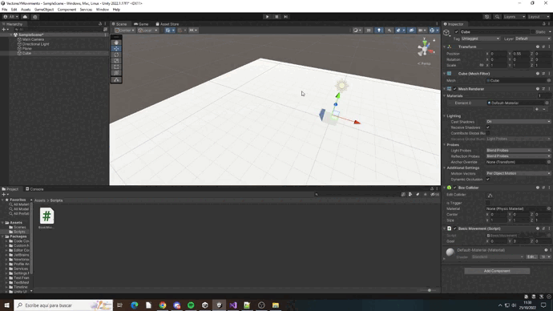
Se utiliza la función MoveTowards de Vector3, con lo cual se mueve a un punto objetivo del espacio

Cómo modificarías el script para que el objeto despegue del suelo y vuele
como un avión
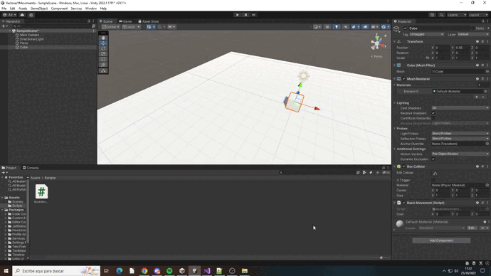
Se modifica la variable publica goal con valores distintos de 0 en X Y y Z

2. Duplicar los valores de X, Y, Z del Objetivo. ¿Es consistente el movimiento?.
● El Objetivo no es un objetivo propiamente dicho, sino una dirección en la
que queremos movernos.
● La información relevante de un vector es la dirección. Los vectores
normalizados, conservan la misma dirección pero su escala no afecta al
movimiento. Esto se consigue con el método normalized de la clase Vector3:
this.transform.Translate(goal.normalized);
● Con el vector normalizado, lo podemos multiplicar por un valor de velocidad
para determinar cómo de rápido va el personaje. public float speed = 0.1f
this.transform.Translate(goal.normalized*speed)
● A pesar de que esas velocidades puedan parecer ahora que son
consistentes, no lo son, porque dependen de la velocidad a la que se
produzca el update. El tiempo entre dos updates no es necesariamente
siempre el mismo, con lo que se pueden tener inconsistencias en la
velocidad, y a pesar de que en aplicaciones con poca complejidad no lo
notemos, se debe usar: this.transform.Translate(goal.normalized *
speed*Time.deltaTime); para suavizar el movimiento ya que Time.deltaTime
es el tiempo que ha pasado desde el último frame.
 
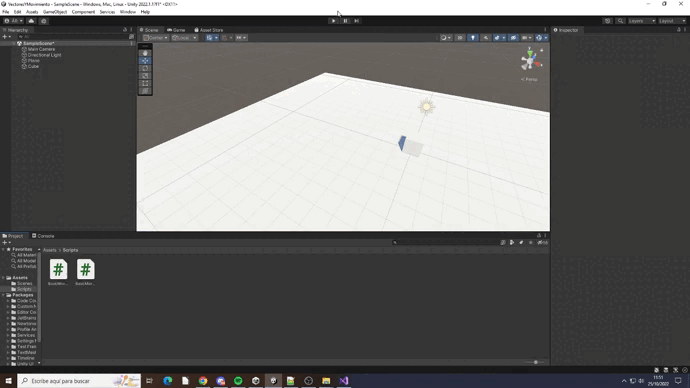
Si en el metodo Translate solo se deja goal.normalized, el movimiento es demasiado rapido.
Para solucionarlo se añade una variable de velocidad y para que este sea constante se añade la el tiempo de los frames.
Si se modifican los valores de X Y y Z se cambia su dirección de movimiento.

3. En lugar de seguir usando una dirección como objetivo, vamos a movernos ahora
hacia una posición objetivo.
● Hacemos el objetivo una variable pública public Transform goal y añadimos
un public float speed = 1.0f.
● La dirección en la que nos tenemos que mover viene determinada por la
diferencia entre la posición del objetivo y nuestra posición:
Vector3 direction = goal.position - this.transform.position;
this.transform.Translate(direction.normalized * speed * Time.deltaTime)

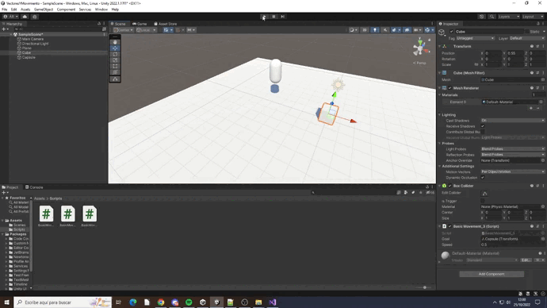
Se añade otro objeto para tenerlo como referencia.
Una vez realizado el cálculo de la dirección, esta se normaliza y se usa para el Translate.

4. Cuando ejecutamos el script, el personaje calcula la dirección hacia el objetivo y se
mueve hacia él (lo podemos probar desde varias posiciones de inicio), pero no
puede dejar de moverse y se produce jittering. La razón es que todavía estamos
dentro del bucle, calculando la dirección y moviéndonos hacia él.
● En la mayoría de los casos no vamos a conseguir que nuestro personaje se
mueva a la posición exacta del objetivo, con lo que continuamente oscila en
torno a esa posición.
● Debemos establecer un rango de tolerancia. Incluimos una variable global
pública, public float accuracy = 0.01f; y una condición
if(direction.magnitude > accuracy). Aún con el accuracy, el personaje
puede hacer jitter si la velocidad es muy alta.

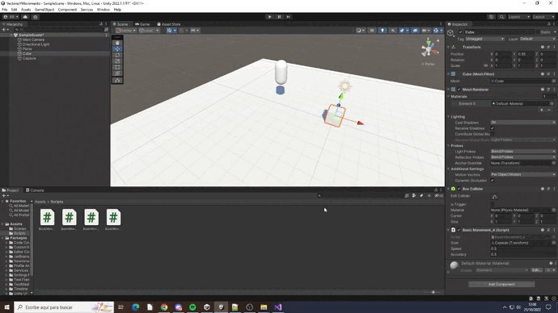
Ese efecto no lo note en el anterior ejercicio, por lo que exageré la variable accuracy para probar se veraderamente funcionaba

5. Girar hacia el objetivo. En este caso, se dispone el método LookAt de la clase
Transform. Debe girarse primero y luego avanzar.
● this.transform.LookAt(goal.position) en el Start para que gire primero y
luego se mueva.
● Si lo ejecutamos en este momento, como la orientación del personaje va a
cambiar, el translate no va a funcionar correctamente porque los ejes del
personaje y el mundo no están alineados. El movimiento se debe hacer de
forma relativa al sistema de referencia del mundo.
this.transform.Translate(direction.normalized * speed * Time.deltaTime,
Space.World).

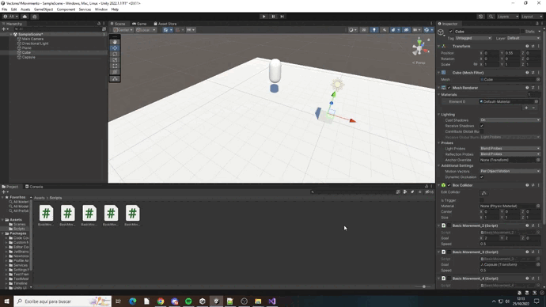
Como indica en el enunciado, primero el cubo mira al objetivo al rotar y luego se mueve hacia el

6. Añadir Debug.DrawRay(this.transform.position,direction,Color.red) para
depuración para comprobar que la dirección está correctamente calculada.

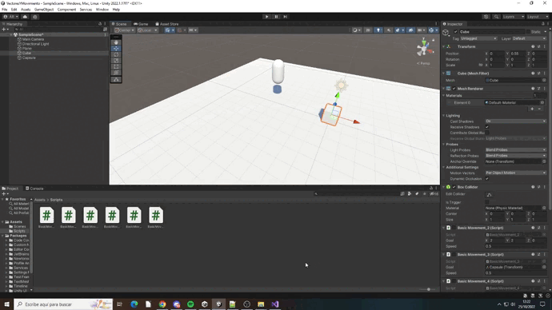

7. Crear un script que haga que el personaje siga al cubo. El cubo debe ser movido
usando las teclas de flechas del Starter Assets.

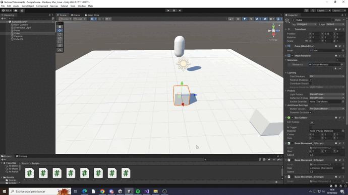
Se ha cambiado el LookAt de los objetos que persiguen al cubo del Start al Update.

8. Crear una escena simple sobre la que probar diferentes configuraciones de objetos
físicos en Unity. La escena debe tener un plano a modo de suelo, dos esferas y un
cubo.
a. Ninguno de los objetos será físico
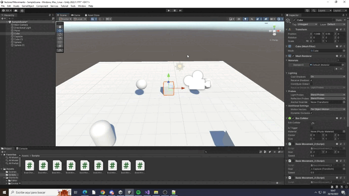

b. Las esfera tiene físicas, el cubo no, pero se puede mover por el controlador
en 3ª persona de los starter Assets.
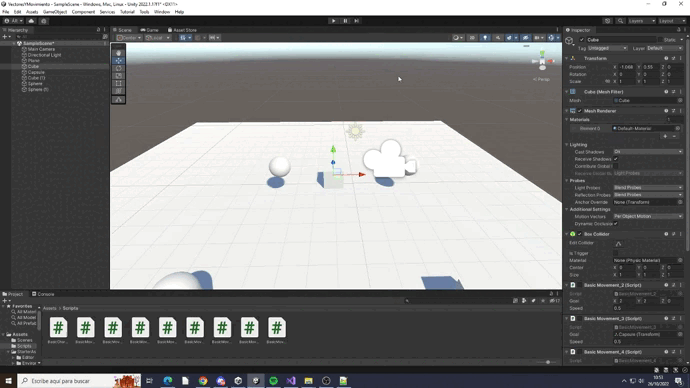
Al no utilizar un controlador con físicas algunas veces no responde correctamente con las físicas de las esferas

c. Las esferas y el cubo tienen físicas. El cubo inicialmente está posicionado
más alto que alguna de las esferas, con el mismo valor de x, z.
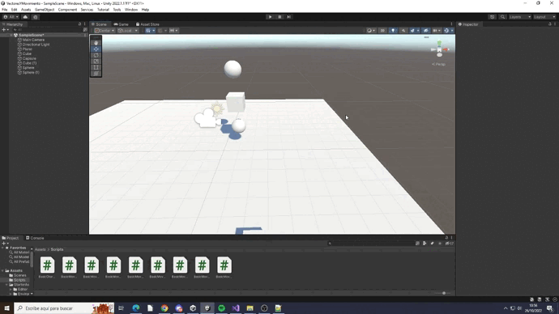

d. Una escena similar a la c, pero alguna esfera tiene 10 veces la masa del
cubo
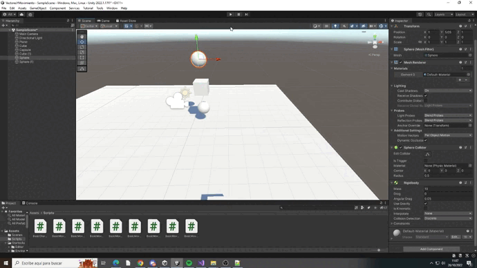
La esfera de arriba es la que tiene más masa

e. Las esferas tienen físicas y el cubo es de tipo IsTrigger estático.
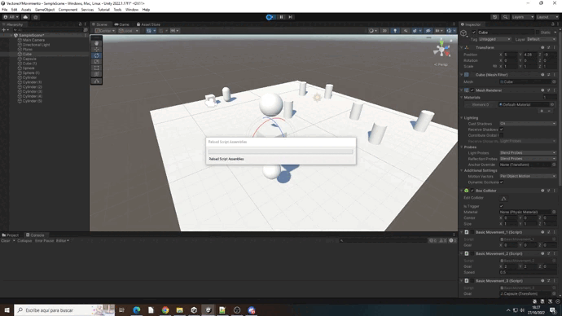
Se ha activado la opcion isTrigger del box collider

f. Las esferas tienen físicas, el cubo es de tipo IsTrigger y cinemático.
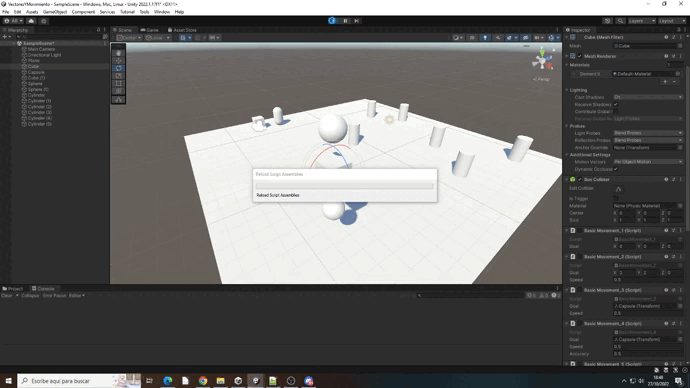
Se ha añadido un Rigidbody y activado la opcion isKinematic del RigidBody

g. Las esferas tienen físicas, el cubo es de tipo IsTrigger y mecánico.
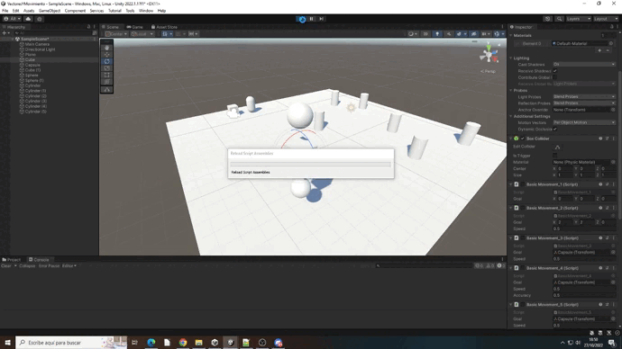
Se ha desactivado la opción isKinematic del Rigidbody

h. Una esfera y el cubo son físicos y la esfera tiene 10 veces la masa del cubo,
se impide la rotación del cubo sobre el plano XZ.
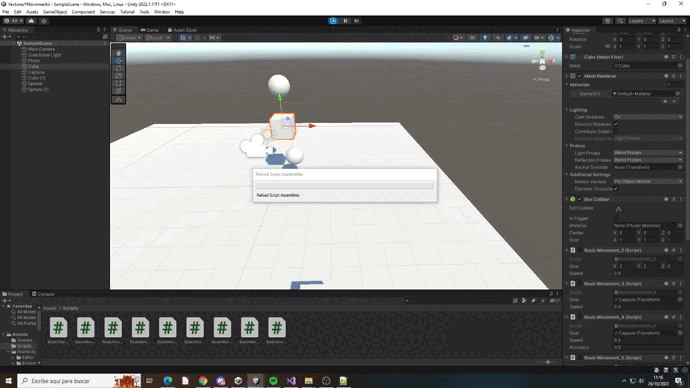
Ahora solo la esfera de arriba y el cubo tienen físicas, y como el cubo no puede rotar en X ni en Z, este no puede
caerse de la esfera aunque este en el borde de la misma

9. Sobre la escena que has trabajado ubica un cubo que represente un personaje que
vas a mover. Se debe implementar un script que haga de CharacterController.
Cuando el jugador pulse las teclas de flecha (o aswd) el jugador se moverá en la
dirección que estos ejes indican.
a. Crear un script para el personaje que lo desplace por la pantalla, sin aplicar
simulación física.
b. Agregar un campo público que permita graduar la velocidad del movimiento
desde el inspector de objetos.
c. Utilizar la tecla de espaciado para incrementar la velocidad del
desplazamiento en el tiempo de juego.
d. Estar a la escucha de si el usuario ha utilizado los ejes virtuales. Elegir
cuáles se va a permitir utilizar: flechas, awsd.
e. Elegir otros ejes virtuales para el giro y girar al jugador sobre el eje OY (up).

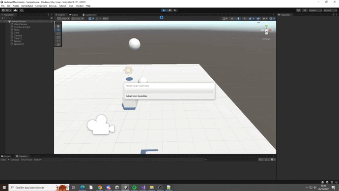
Las flechas AWSD se utilizan para el movimiento, mientras que OP se utilizan para la rotación. Además, si se utiliza
la tecla del espaciado se duplica la velocidad de movimiento y de giro.

10. Sobre la escena que has trabajado programa los scripts necesarios para las
siguientes acciones:
● Se deben incluir varios cilindros sobre la escena. Cada vez que el objeto jugador
colisione con alguno de ellos, se debe mostrar en la consola un mensaje indicando
el nombre del cilindro con el que colisiona, cambiar a color rojo y el jugador
aumentar la puntuación

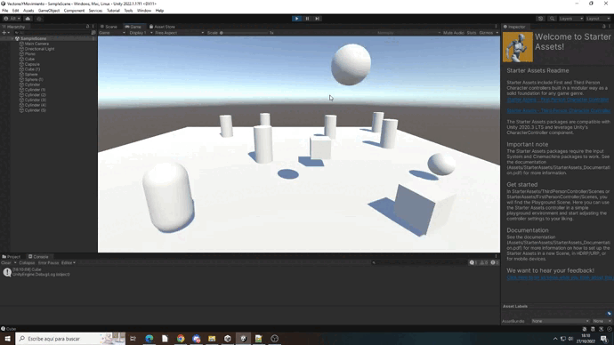
Se ha creado un fichero a parte que hace uso de variables estáticas, es necesario para añadir valores a la puntuación.
Quien suma el valor a la puntuación es el cilindro al chocar, para ello se hace uso del método OnTriggerEnter.
Una vez dentro del método, se comprueba que quien toco al cilindro fue el cubo y luego cambia el color al material del cilindro.